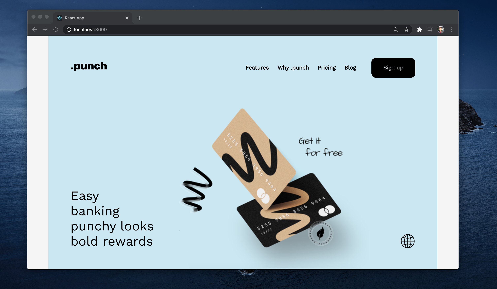

# Demo React App Image
This project is an intégration based on this design found on [dribble](https://dribbble.com/shots/14375856/attachments/6045671?mode=media).
The Responsive design is in progress

# Getting Started with Create React App

This project was bootstrapped with [Create React App](https://github.com/facebook/create-react-app).

## Available Scripts

In the project directory, you can run:

### `npm start`

Runs the app in the development mode.\
Open [http://localhost:3000](http://localhost:3000) to view it in the browser.

The page will reload if you make edits.\
You will also see any lint errors in the console.

